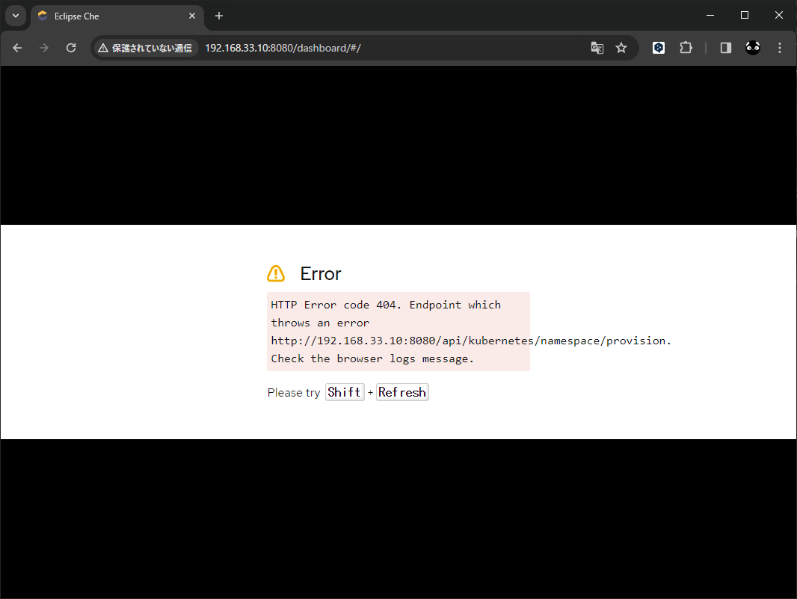

# vagrant_minikube_eclipse_che

[Installing Che on Minikube](https://eclipse.dev/che/docs/stable/administration-guide/installing-che-on-minikube/)

## [minikube start](https://minikube.sigs.k8s.io/docs/start/)

インストール  
Operating system: Linux  
Architecture: x86-64  
Release type: Stable  
Installer type: Binary download  
```
curl -LO https://storage.googleapis.com/minikube/releases/latest/minikube-linux-amd64
sudo install minikube-linux-amd64 /usr/local/bin/minikube && rm minikube-linux-amd64
```

バージョン確認
```
$ minikube version
minikube version: v1.32.0
commit: 8220a6eb95f0a4d75f7f2d7b14cef975f050512d
```

## [Install and Set Up kubectl on Linux](https://kubernetes.io/docs/tasks/tools/install-kubectl-linux/)

諸々ダウンロード
```
curl -LO "https://dl.k8s.io/release/$(curl -L -s https://dl.k8s.io/release/stable.txt)/bin/linux/amd64/kubectl"
curl -LO "https://dl.k8s.io/release/$(curl -L -s https://dl.k8s.io/release/stable.txt)/bin/linux/amd64/kubectl.sha256"
echo "$(cat kubectl.sha256)  kubectl" | sha256sum --check
```

チェックサムが一致するか確認
```
$ echo "$(cat kubectl.sha256)  kubectl" | sha256sum --check
kubectl: OK
```

一致したらインストール
```
sudo install -o root -g root -m 0755 kubectl /usr/local/bin/kubectl
```

バージョン確認
```
$ kubectl version --client
Client Version: v1.29.3
Kustomize Version: v5.0.4-0.20230601165947-6ce0bf390ce3
```

## [Installing the chectl management tool](https://eclipse.dev/che/docs/stable/administration-guide/installing-the-chectl-management-tool/)

インストール
```
bash <(curl -sL  https://www.eclipse.org/che/chectl/)
```

バージョン確認
```
$ chectl --version
chectl/7.84.0 linux-x64 node-v18.18.0
```

## Start Minikube


```
minikube start \
  --addons=ingress,dashboard \
  --vm=true \
  --driver=docker \
  --memory=7168 \
  --cpus=4 \
  --disk-size=20GB \
  --kubernetes-version=v1.23.9
```
※driver の指定を追加、memory を 8 GB から 1 GB 引いて 7 GB で指定(失敗残りが少なすぎた)、disk-size を 20 GB に指定( 50 GB も残ってない)

```
$ minikube start \
>   --addons=ingress,dashboard \
>   --vm=true \
>   --memory=7168 \
>   --cpus=4 \
>   --disk-size=20GB \
>   --kubernetes-version=v1.23.9
😄  Almalinux 9.3 (vbox/amd64) 上の minikube v1.32.0
👎  デフォルトドライバーを採用できませんでした。こちらが可能性の高い順に考えられる事です:
💡  代わりに、これらのドライバーのいずれかをインストールすることもできます:
    ▪ kvm2: Not installed: exec: "virsh": executable file not found in $PATH
    ▪ qemu2: Not installed: exec: "qemu-system-x86_64": executable file not found in $PATH
    ▪ virtualbox: Not installed: unable to find VBoxManage in $PATH

❌  DRV_NOT_DETECTED が原因で終了します: 利用可能なドライバーが検出されませんでした。--driver 指定を試すか、https://minikube.sigs.k8s.io/docs/start/ を参照してください
```

```
$ minikube start \
>   --addons=ingress,dashboard \
>   --vm=true \
>   --driver=docker \
>   --memory=7168 \
>   --cpus=4 \
>   --disk-size=20GB \
>   --kubernetes-version=v1.23.9
😄  Almalinux 9.3 (vbox/amd64) 上の minikube v1.32.0
✨  ユーザーの設定に基づいて docker ドライバーを使用します

🧯  要求された 7168MiB のメモリー割当は、システムのオーバーヘッド (合計システムメモリー: 7913MiB) に十分な空きを残しません。安定性の問題に直面するかも知れません。
💡  提案: Start minikube with less memory allocated: 'minikube start --memory=7168mb'

📌  root 権限を持つ Docker ドライバーを使用
👍  minikube クラスター中のコントロールプレーンの minikube ノードを起動しています
🚜  ベースイメージを取得しています...
💾  ロード済み Kubernetes v1.23.9 をダウンロードしています...
    > preloaded-images-k8s-v18-v1...:  400.36 MiB / 400.36 MiB  100.00% 21.66 M
    > gcr.io/k8s-minikube/kicbase...:  453.90 MiB / 453.90 MiB  100.00% 24.56 M
🔥  Creating docker container (CPUs=4, Memory=7168MB) ...
🐳  Docker 24.0.7 で Kubernetes v1.23.9 を準備しています...
❌  キャッシュされたイメージを読み込めません: loading cached images: stat /home/vagrant/.minikube/cache/images/amd64/registry.k8s.io/etcd_3.5.1-0: no such file or directory
    ▪ 証明書と鍵を作成しています...
    ▪ コントロールプレーンを起動しています...
    ▪ RBAC のルールを設定中です...
    ▪ registry.k8s.io/ingress-nginx/controller:v1.9.4 イメージを使用しています
    ▪ registry.k8s.io/ingress-nginx/kube-webhook-certgen:v20231011-8b53cabe0 イメージを使用しています
    ▪ gcr.io/k8s-minikube/storage-provisioner:v5 イメージを使用しています
    ▪ registry.k8s.io/ingress-nginx/kube-webhook-certgen:v20231011-8b53cabe0 イメージを使用しています
    ▪ docker.io/kubernetesui/dashboard:v2.7.0 イメージを使用しています
    ▪ docker.io/kubernetesui/metrics-scraper:v1.0.8 イメージを使用しています
🔎  Kubernetes コンポーネントを検証しています...
🔎  ingress アドオンを検証しています...
💡  いくつかのダッシュボード機能は metrics-server アドオンを必要とします。全機能を有効にするためには、次のコマンドを実行します:

        minikube addons enable metrics-server


🌟  有効なアドオン: storage-provisioner, default-storageclass, dashboard, ingress

❗  /usr/local/bin/kubectl のバージョンは 1.29.3 で、Kubernetes 1.23.9 と互換性がないかもしれません。
    ▪ kubectl v1.23.9 が必要ですか？ 'minikube kubectl -- get pods -A' を試してみてください
🏄  終了しました！kubectl がデフォルトで「minikube」クラスターと「default」ネームスペースを使用するよう設定されました
```

## Create the Che instance

```
chectl server:deploy --platform minikube
```

かなり時間かかる
```
$ chectl server:deploy --platform minikube
Enable CLI usage data to be sent to Red Hat online services. More info: https://developers.redhat.com/article/tool-data-collection [y/n]: n
› Current Kubernetes context: 'minikube'
  ✔ Verify Kubernetes API...[1.23]
  ✔ Minikube preflight checklist
    ✔ Verify if kubectl is installed...[OK]
    ✔ Verify if minikube is installed...[OK]
    ✔ Verify if minikube is running...[OK]
    ✔ Enable minikube ingress addon...[Enabled]
    ✔ Retrieving minikube IP and domain for ingress URLs...[192.168.49.2.nip.io]
    ✔ Checking minikube version...[1.32.0]
  ✔ Create Namespace eclipse-che...[Created]
～～～～～～～～～～～～～～～～～～～～～～～～～～～～～～～～～～～～～～～～
～～～～～～～～～～～～～～～～～～～～～～～～～～～～～～～～～～～～～～～～
  ✔ Prepare post installation output...[OK]
  ✔ Show important messages
    ✔ Eclipse Che 7.84.0 has been successfully deployed.
    ✔ Documentation             : https://www.eclipse.org/che/docs/
    ✔ -------------------------------------------------------------------------------
    ✔ Users Dashboard           : https://192.168.49.2.nip.io/dashboard/
    ✔ -------------------------------------------------------------------------------
    ✔ Plug-in Registry          : https://192.168.49.2.nip.io/plugin-registry/v3/
    ✔ Devfile Registry          : https://registry.devfile.io/
    ✔ -------------------------------------------------------------------------------
    ✔ Dex user credentials      : che@eclipse.org:admin
    ✔ Dex user credentials      : user1@che:password
    ✔ Dex user credentials      : user2@che:password
    ✔ Dex user credentials      : user3@che:password
    ✔ Dex user credentials      : user4@che:password
    ✔ Dex user credentials      : user5@che:password
    ✔ -------------------------------------------------------------------------------
Command server:deploy has completed successfully in 14:20.
```

```
chectl server:status
```

```
$ chectl server:status
Eclipse Che Version    : 7.84.0
Eclipse Che Url        : https://192.168.49.2.nip.io/dashboard/
```

```
https://192.168.33.10.nip.io/dashboard/
```


## 再チャレンジ

```
minikube start \
  --addons=ingress,dashboard \
  --driver=docker \
  --memory=6144 \
  --cpus=4 \
  --disk-size=20GB
```

```
$ minikube start \
>   --addons=ingress,dashboard \
>   --driver=docker \
>   --memory=6144 \
>   --cpus=4 \
>   --disk-size=20GB
😄  Almalinux 9.3 (vbox/amd64) 上の minikube v1.32.0
✨  ユーザーの設定に基づいて docker ドライバーを使用します
📌  root 権限を持つ Docker ドライバーを使用
👍  minikube クラスター中のコントロールプレーンの minikube ノードを起動しています
🚜  ベースイメージを取得しています...
💾  ロード済み Kubernetes v1.28.3 をダウンロードしています...
    > preloaded-images-k8s-v18-v1...:  403.35 MiB / 403.35 MiB  100.00% 25.67 M
    > gcr.io/k8s-minikube/kicbase...:  453.90 MiB / 453.90 MiB  100.00% 24.66 M
🔥  Creating docker container (CPUs=4, Memory=6144MB) ...
🐳  Docker 24.0.7 で Kubernetes v1.28.3 を準備しています...
    ▪ 証明書と鍵を作成しています...
    ▪ コントロールプレーンを起動しています...
    ▪ RBAC のルールを設定中です...
🔗  bridge CNI (コンテナーネットワークインターフェース) を設定中です...
    ▪ docker.io/kubernetesui/dashboard:v2.7.0 イメージを使用しています
    ▪ gcr.io/k8s-minikube/storage-provisioner:v5 イメージを使用しています
    ▪ docker.io/kubernetesui/metrics-scraper:v1.0.8 イメージを使用しています
    ▪ registry.k8s.io/ingress-nginx/controller:v1.9.4 イメージを使用しています
🔎  Kubernetes コンポーネントを検証しています...
    ▪ registry.k8s.io/ingress-nginx/kube-webhook-certgen:v20231011-8b53cabe0 イメージを使用しています
    ▪ registry.k8s.io/ingress-nginx/kube-webhook-certgen:v20231011-8b53cabe0 イメージを使用しています
🔎  ingress アドオンを検証しています...
💡  いくつかのダッシュボード機能は metrics-server アドオンを必要とします。全機能を有効にするためには、次のコマンドを実行します:

        minikube addons enable metrics-server


🌟  有効なアドオン: storage-provisioner, dashboard, default-storageclass, ingress
🏄  終了しました！kubectl がデフォルトで「minikube」クラスターと「default」ネームスペースを使用するよう設定されました
```

```
$ chectl server:deploy --platform minikube
Enable CLI usage data to be sent to Red Hat online services. More info: https://developers.redhat.com/article/tool-data-collection [y/n]: n
› Current Kubernetes context: 'minikube'
  ✔ Verify Kubernetes API...[1.28]
  ✔ Minikube preflight checklist
    ✔ Verify if kubectl is installed...[OK]
    ✔ Verify if minikube is installed...[OK]
    ✔ Verify if minikube is running...[OK]
    ✔ Enable minikube ingress addon...[Enabled]
    ✔ Retrieving minikube IP and domain for ingress URLs...[192.168.49.2.nip.io]
    ✔ Checking minikube version...[1.32.0]
  ✔ Create Namespace eclipse-che...[Created]
～～～～～～～～～～～～～～～～～～～～～～～～～～～～～～～～～～～～～
  ✔ Prepare post installation output...[OK]
  ✔ Show important messages
    ✔ Eclipse Che 7.84.0 has been successfully deployed.
    ✔ Documentation             : https://www.eclipse.org/che/docs/
    ✔ -------------------------------------------------------------------------------
    ✔ Users Dashboard           : https://192.168.49.2.nip.io/dashboard/
    ✔ -------------------------------------------------------------------------------
    ✔ Plug-in Registry          : https://192.168.49.2.nip.io/plugin-registry/v3/
    ✔ Devfile Registry          : https://registry.devfile.io/
    ✔ -------------------------------------------------------------------------------
    ✔ Dex user credentials      : che@eclipse.org:admin
    ✔ Dex user credentials      : user1@che:password
    ✔ Dex user credentials      : user2@che:password
    ✔ Dex user credentials      : user3@che:password
    ✔ Dex user credentials      : user4@che:password
    ✔ Dex user credentials      : user5@che:password
    ✔ -------------------------------------------------------------------------------
Command server:deploy has completed successfully in 11:00.
```

`https://192.168.49.2.nip.io/dashboard/` ホストからアクセスする方法がわからん...
以下、試行錯誤のメモ

```
minikube tunnel
```
※ロードバランサーに設定しないとこれは意味がない

```
kubectl port-forward --address 0.0.0.0 svc/che-dashboard 8080:8080 -n eclipse-che
```
※つなげたけどエラー


## やっぱりダメだったよ...疲れたので一旦ここまで...
